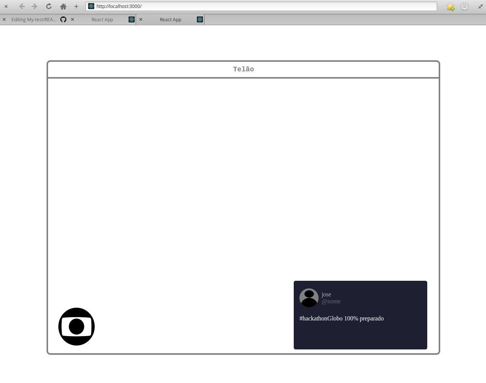
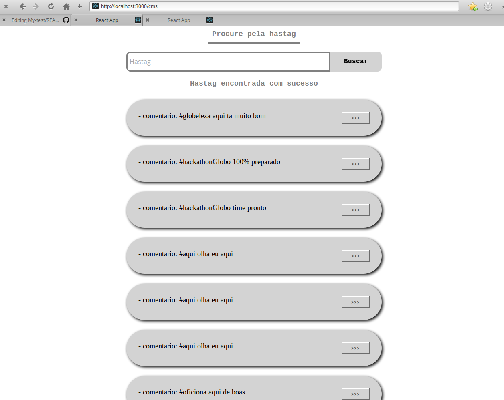

# My-test

Projeto para melhorar minhas skills

# Rodando o projeto

### Instalação YARN

- Devido está usando yarn Workspaces, precisamos utilizilar o yarn para a instalação.
[Yarn install](https://yarnpkg.com/en/docs/install)

### Rodando no seu PC

- Para clonar o projeto `git clone https://github.com/Wellers0n/My-test.git`
- Entrar na pasta `cd My-test/`
- Para instalar dependência do projeto: `yarn install`
- Depois da instalação das dependências rode `yarn start` no diretório padão

# Adicionando comentários no MongoDB

 ### Instalação do Mongodb no seu PC
 
 - Para instalar [click aqui](https://docs.mongodb.com/manual/installation/)
 
 ### Iniciando com o mongo
 
 - Vá no terminal e digite: `mongo`
 - Usando o banco dessa aplicação: `use globo`
 - Adicionando comentario: `db.hastags.save({nome: "nome-qualquer", comentario: "comentario-qualquer"})`adicione 5 comentários
 - PS: optei por fazer dessa maneiro por motivos de tempo, e o mongoLab estava dando error na aplicação e eu estava sem tempo
  
# Rotas da aplicação
  
### Rota Home
- acesse: `http://localhost:3000`

### Rota CMS
- acesse: `http://localhost:3000/cms`

# Dependência usadas no projeto

[ReactJS](https://reactjs.org/) 
[KoaJS](https://koajs.com/) 
[MongoDB](https://www.mongodb.com/) 
[LernaJS](https://lernajs.io/) 
[Socket.io](https://socket.io/) 
[Yarn](https://yarnpkg.com/en/) 
[WorkSpaces](https://yarnpkg.com/lang/en/docs/workspaces/) 
